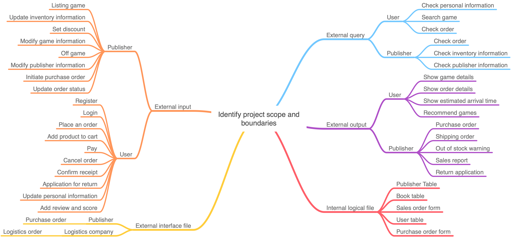
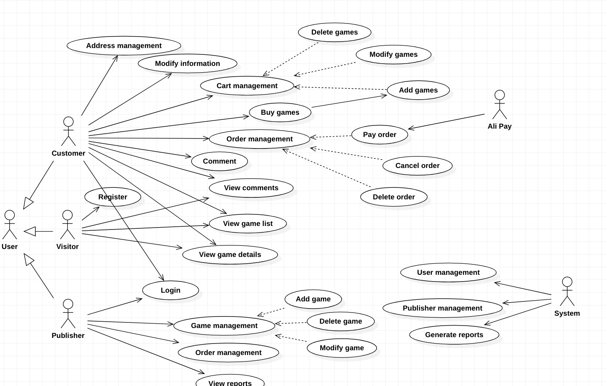
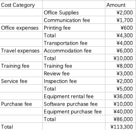
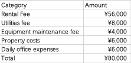
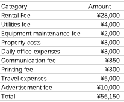
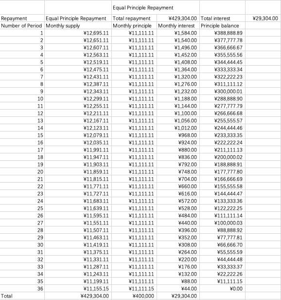
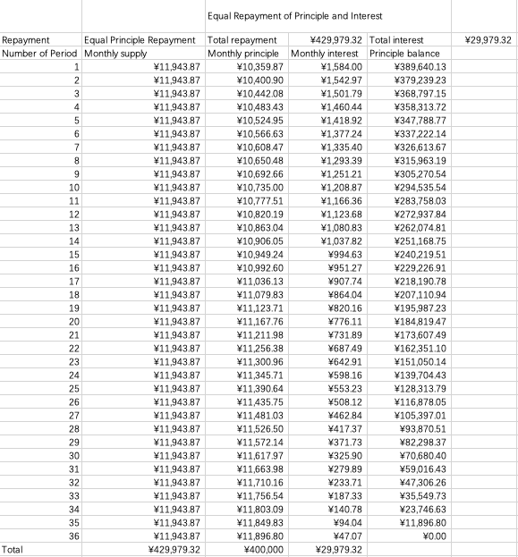

## Budget

[toc]

------

### 2.1 Statement

Before the content of the financial management document, we first explain our basic conditions and premises:

1. Our company is an independent Internet company that aims to develop a console game platform. At first, it may not pay attention to revenue and value the popularity and the number of users. After delivery, we will continue to maintain and improve the system.
2. The development cycle of the game platform ICE starts on March 10 and lasts about 4 months (17 weeks according to the plan).
3. Suppose our staff trains ICE platform administrators for 3 weeks, and it is only needed in the first month of a development cycle.
4. Apply for a loan at the beginning of the development process.
5. The length of the recorded financial data is 4 years.

### 2.2 Effort Estimation

### 2.2.1 Function points estimation

This project adopts the project estimation method based on **Function Points**, focusing on the value of information domain, external input, external output, external query, internal logic document, external interface file identification and counting.

We use **IFPUG standard** to analysis Function Points of our project, the steps are as following:

1. Identify project scope and boundaries

   

2. Use usecase diagrams to visualize the use cases(According to the scope and boundaries, but we make some adaptive adjustment here)

   

3. According to the five basic function types, we can get the **unadjusted function points**(based on both the mind map and the usecase diagram)

   

4. The complexity matrix is calculated based on the complexity of the external user types, and the functions points of each complexity  level are obtained by multiplying the number of external user types by the score value. As a result, we got the total UFP: 157.

5. The adjustment factor VAF is determined acccording to the 14 basic system characteristics by **Relative Complexity Adjustment Factor(RCAF)**, and the adjustment factor is applied to the unadjusted function point. Then we calculate the adjusted function points as follow:

   | No.  | System Characteristic                                        | Score |
   | ---- | ------------------------------------------------------------ | ----- |
   | 1    | Requirement for reliable backup and recovery                 | 2     |
   | 2    | Requirement for data communication                           | 3     |
   | 3    | Extent of distributed processing                             | 2     |
   | 4    | Performance requirements                                     | 5     |
   | 5    | Expected operational environment                             | 2     |
   | 6    | Extent of online data entries                                | 3     |
   | 7    | Extent of multi-screen or multi-operation online data input  | 0     |
   | 8    | Extent of online updating of master files                    | 2     |
   | 9    | Extent of complex inputs, outputs, online queries and files  | 1     |
   | 10   | Extent of complex data processing                            | 3     |
   | 11   | Extent that currently developed code can be designed for reuse | 3     |
   | 12   | Extent of conversion and installation included in the design | 2     |
   | 13   | Extent of multiple installations in an organization and variety of customer organizations | 0     |
   | 14   | Extent of change and focus on ease of use                    | 4     |
   |      | **Total**                                                    | 32    |

   Then we can get **VAF(Value Adjustment Factor)** by
   $$
   VAF = 0.65 + (0.01 * SUM(score)) = 0.97
   $$

6. Finally, we can get FP by
   $$
   FP = UFP * VAF = 152.29
   $$
   

#### 2.2.2 Development Effort Estimation

1. Software scale estimation

   Scale calculation formula:
   $$
   S = US\times CF
   $$

   $S$ : Adjusted scale, unit is function point (FP).

   $US$：Without adjusting the scale, the unit is function point (FP) , which is the $FP$ calculated above.

   $CF$：The scale change factor, which estimates the later planning stage, takes a value of 1. (Judging from the late estimation of the benchmark data of the Chinese software industry in 2019)

   The calculation is:
$$
   S = 152.29FP
$$

2. Adjusted effort estimates

   According to the unadjusted workload calculation formula:
   $$
   UE=C\times S^{a}
   $$
   $UE$：Unadjusted workload, unit is man-hours (ph).

   $C$：Productivity adjustment factor, the median value of software development productivity of industry benchmark data is 7.10 person-hours/FP. (2019 China Software Industry Benchmark Data)

   

   Take the productivity adjustment factors at the time points 25, 50, and 75 of the function points as follows:

   - $P25$ = 4.08

   - $P50$ = 7.10

   - $P75$ = 12.37

   $a$：The software scale adjustment coefficient calculated based on the benchmark data , which is assumed to be 1.

   The calculation is:
   $$
   \begin{align}
   UE_{25} =& 621.34\\
   UE_{50} =& 1080.26\\ 
   UE_{75} =& 1883.83
   \end{align}
   $$

   According to the adjustment workload calculation formula:
$$
   AE=UE\times A\times IL\times L\times T
$$
   $AE$：Adjusted workload, unit is man-hour (ph).

   $A$：Application field adjustment factor, value range 0.8~1.2, value 1.0 (check parameter table).

   $IL$：Integrity level, value range 1.0~1.8, value 1.1 (check parameter table).

   $L$：Development language adjustment factor, value range 0.8~1.2, value 1.0 (check parameter table).

   $T$：Maximum team size, value range 0.8~1.2, value 1.0 (check parameter table).

   The calculation is:
$$
   \begin{align}
   AE_{25} =& 683.48\\
   AE_{50} =& 1189.38\\ 
   AE_{75} =& 2072.21
   \end{align}
$$
   (When unit is ph, subscript represents percentage)

   According to the specification, assuming 8 hours of work per day and 21.75 days per month, the converted workload is:
$$
   \begin{align}
   AE_{25} =& 3.928\\
   AE_{50} =& 6.836\\ 
   AE_{75} =& 11.909
   \end{align}
$$
   (Unit is pm, the following table represents the percentage)

   Subsequent calculations will use the 50th percentile workload of $6.836$ person-months.

#### 2.2.3 Operation and Maintenance Effort Estimation

Based on China's software industry benchmark database for operation and maintenance cost estimation, it is also necessary to first estimate the scale, and then estimate the workload and expenses.

From the above, the estimated results of the software scale are:
$$
S = 152.29FP
$$
Through reference materials, we found a workload calculation method similar to the above:
$$
工作量AE = 调整后规模\times 生产率调整因子\times 运维水平要求因素 \times 运维能力因素 \times  运维系统特征因素
$$

- Productivity adjustment factor: The software operation and maintenance productivity median value of industry benchmark data is 0.92 person-hours/FP.

  

  Take the productivity adjustment factors at the time points 25, 50, and 75 of the function points as follows:

  - $P25$ = 0.57

  - $P50$ = 0.92

  - $P75$ = 1.54

- Factors required for operation and maintenance level : value 0.95.

- Operation and maintenance capability factor :  value 1.00.

- Characteristic factors of operation and maintenance system : value 1.14.

The calculated effort is:
$$
\begin{align}
AE_{25} =& 94.01\\
AE_{50} =& 151.74\\ 
AE_{75} =& 253.99
\end{align}
$$
(When unit is ph, subscript represents percentage)

According to the specification, assuming 8 hours of work per day and 21.75 days per month, the converted workload is:
$$
\begin{align}
AE_{25} =& 0.540\\
AE_{50} =& 0.872\\ 
AE_{75} =& 1.460
\end{align}
$$
(Unit is pm, the following table represents the percentage)

Subsequent calculations will use the 50th percentile workload of $0.872$ person-months.

### 2.3 Development Cost Estimation

#### 2.3.1 Direct Labor Cost Estimation

The direct labor cost includes the human resources expenses such as the salaries, bonuses and benefits of the project team members of the developer. Among them, project members include all R&D or support personnel involved in the project's R&D process, such as project managers, requirements analysts, designers, developers, testers, deployers, user documentation writers, quality assurance personnel, configuration managers, etc. . For the part-time personnel engaged in the research and development of the project, the human resources cost is converted according to the proportion of the project workload in their total workload.

| Activity       | Requirement | Design   | Constructure | Test     | Deployment |
| -------------- | ----------- | -------- | ------------ | -------- | ---------- |
| Effort percent | 13.95%      | 13.16%   | 40.26%       | 21.89%   | 10.74%     |
| Effort (pm)    | 0.9536pm    | 0.8996pm | 2.7522pm     | 1.4964pm | 0.7342pm   |

According to the industry monthly benchmark rate data, the average monthly rate in Shanghai is 28548 yuan/pm. This data represents the median of the regional statistics (P50), which is 21.75 days in January. **Expenses include direct labor costs for software development, indirect labor costs, some indirect non-labor costs and reasonable profits, excluding direct non-labor costs**. 

For insurance, the calculation is: **direct labor cost + indirect labor cost =** $195154$ *Yuan*. (No longer calculated after indirect labor cost)

#### 2.3.2 Direct non-labor Cost Estimates

Direct non-labor costs mainly include:

1. Office expenses, that is, the administrative office expenses incurred by the developer to develop this project, such as office supplies, communications, mailing, printing, conferences, etc.;
2. Travel expenses, that is, travel expenses incurred by the developer to develop this project, such as transportation, accommodation, and travel subsidies;
3. Training fee, that is, the cost of special training arranged by the developer for research and development of this project;
4. Business expenses, that is, expenses incurred by the developer in order to complete the R&D work of this project, such as hospitality fees, review fees, inspection fees, etc.;
5. Procurement fee, that is, the developer needs to purchase special assets or services for the development of this project, such as special equipment fee, special software fee, technical cooperation fee, patent fee, etc.;
6. Others, that is not listed in the above project but it is the cost of the developer to develop this project.

#### 2.3.3 Indirect Labor Cost Estimation

Indirect labor cost refers to the allocation of human resources costs of non-project team personnel who serve the overall needs of R&D management. Including the allocation of wages, bonuses, benefits, etc. of R&D department managers, project management office (PMO) personnel, engineering process group (EPG) personnel, product planners, organization-level quality assurance personnel, organization-level configuration management personnel, etc.

#### 2.3.4 Indirect non-labor Cost Estimates

Indirect non-labor cost refers to the non-labor cost allocation that the developer does not incur for a specific project, but serves the overall R&D activities. Including the rent of the R&D site of the developer, water and electricity, and property, the allocation of the daily office expenses of the R&D personnel, and the rental, maintenance, and depreciation of various R&D office equipment.

#### 2.3.5 Total Development Cost Estimate

According to the calculation formula of software development cost:
$$
SDC=DHC+DNC+IHC+INC
$$
$SDC$：Software R&D cost, the unit is yuan;

$DHC$：Direct labor cost, the unit is yuan;

$DNC$：Direct non-labor costs, the unit is yuan;

$IHC$：Indirect labor cost, the unit is yuan;

$INC$：Indirect non-labor costs, the unit is yuan.

Calculated software development cost:
$$
SDC=388454¥
$$

### 2.4 Operation and Maintenance Cost Estimation

#### 2.4.1 Labor Cost Estimation (direct + indirect)

According to the benchmark data of the industry monthly rate, the average monthly rate in Shanghai is 23,593 yuan/pm. This data represents the median of the regional statistics (P50), which is 21.75 days in January. **Expenses include direct labor costs for software development, indirect labor costs, some indirect non-labor costs and reasonable profits, excluding direct non-labor costs**.

For insurance, the calculation is: **direct labor cost + indirect labor cost =** $20573$ *Yuan*. (Workload during operation and maintenance period 0.872 person-months)

#### 2.4.2 Non-labor Cost Estimates (direct + indirect)

Addition calculation:
$$
运维成本总计为：76723¥
$$

### 2.5 Source of Budgets

| source | Ourselves   | ICBC        | Game Company | Total       |
| ------ | ----------- | ----------- | ------------ | ----------- |
| Amount | ¥250,000.00 | ¥400,000.00 | ¥200,000.00  | ¥850,000.00 |
| Type   | Originator  | Liability   | Shareholders |             |

### 2.6 Repayment Strategies

If you want to repay 400,000.00 yuan, and consider that the annual interest rate is 4.75% (medium and long-term loans: one to five years, including five years), which is equivalent to a monthly interest rate of 0.396%, and the plan is to pay off in three years. We can choose two repayment methods: equal principal repayment.

#### 2.6.1 Equivalent Principal:

For this method, the loan payment is equal to the sum of principal and interest. For fixed principal loans, the loan repayment amount will decrease during the loan term. The principal included in each payment remains unchanged, but the interest decreases during each payment period. The fixed principal loan plan is also called "fixed principal falling interest loan amortization plan".

#### 2.6.2 Equal Repayment of Principal and Interest: (selected)

For this method, the repayment amount remains unchanged during the mortgage period. Each payment will reduce the principal, resulting in a reduction in interest payable. During the loan period, the payment amount is the same, but the payment method has changed: the portion of the payment applied to the principal increases with time, and the portion used for interest decreases because the principal owed is less.

We chose this method to repay the loan, because the payment for the first three months is much lower than the latter method. In addition, the difference between the two methods in the final payment is small. Therefore, considering these factors, we decided to choose the second factor.